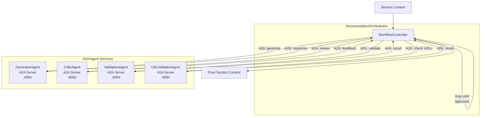

<!-- ba8b7582-630e-4ec2-b543-28537764407f 72cfda0f-1087-4a2e-a681-ddff14cccfec -->
# Multi-Agent Documentation Workflow with A2A Protocol

## Summary

Introduce a multi-agent system using ADK's A2A (Agent-to-Agent) protocol. Each specialized agent (Generator, Critic, Validator, URLValidator) exposes an A2A endpoint via AgentCard. The orchestrator communicates with agents using the A2A protocol, enabling feedback loops where agents collaborate to refine documentation.

## Architecture



## Key Design Decisions

1. **A2A Protocol**: Each agent runs as an A2A server with its own AgentCard. The orchestrator uses `remoteagent.NewA2A()` to connect to agents via their AgentCard URLs.

2. **Agent Registry**: Create an `AgentRegistry` that manages agent configurations including A2A endpoints. Supports both local (in-process) and remote (A2A) agents.

3. **AgentCard-based Discovery**: Each agent publishes an AgentCard at `/.well-known/agent.json` describing its capabilities (skills, input/output schemas).

4. **Message-based Communication**: Agents communicate via A2A messages with structured parts.

5. **Workflow Controller**: Orchestrates the feedback loop using ADK's `loopagent`, connecting to A2A agents as sub-agents.

## File Changes

### New Files

| File | Purpose |

|------|---------|

| `internal/llmagent/docagent/agents/registry.go` | Agent registry, A2A config, and common interface |

| `internal/llmagent/docagent/agents/generator.go` | Generator A2A agent (refactored from existing) |

| `internal/llmagent/docagent/agents/critic.go` | Critic A2A agent stub |

| `internal/llmagent/docagent/agents/validator.go` | Validation A2A agent stub |

| `internal/llmagent/docagent/agents/urlvalidator.go` | URL validator A2A agent stub |

| `internal/llmagent/docagent/agents/server.go` | A2A server setup for agents |

| `internal/llmagent/docagent/workflow/workflow.go` | Workflow orchestrator with A2A clients |

| `internal/llmagent/docagent/workflow/config.go` | Workflow configuration |

### Modified Files

| File | Changes |

|------|---------|

| [`internal/llmagent/docagent/docagent.go`](internal/llmagent/docagent/docagent.go) | Integrate A2A workflow orchestrator |

| [`internal/llmagent/tracing/tracing.go`](internal/llmagent/tracing/tracing.go) | Add A2A-aware tracing spans |

## Implementation Details

### Agent Interface with A2A Support

```go
// SectionAgent defines the interface for A2A-capable documentation agents
type SectionAgent interface {
    Name() string
    Description() string
    // BuildAgent creates the underlying ADK agent
    BuildAgent(ctx context.Context, cfg AgentConfig) (agent.Agent, error)
    // BuildAgentCard returns the A2A AgentCard for this agent
    BuildAgentCard(baseURL string) *a2a.AgentCard
}
```

### A2A Server Factory

```go
// AgentServer wraps an agent with A2A server capabilities
type AgentServer struct {
    agent    agent.Agent
    card     *a2a.AgentCard
    listener net.Listener
}

func StartAgentServer(ctx context.Context, agent SectionAgent, port int) (*AgentServer, error)
```

### Workflow with Remote Agents

```go
// WorkflowBuilder creates workflows using A2A remote agents
type WorkflowBuilder struct {
    registry      *AgentRegistry
    maxIterations uint
}

func (b *WorkflowBuilder) BuildSectionWorkflow(ctx context.Context) (agent.Agent, error) {
    // Create remote agents via A2A
    generator, _ := remoteagent.NewA2A(remoteagent.A2AConfig{
        Name: "generator",
        AgentCardSource: b.registry.GetAgentURL("generator"),
    })
    // ... similar for other agents
    
    // Combine into loop workflow
    return loopagent.New(loopagent.Config{
        AgentConfig: agent.Config{SubAgents: []agent.Agent{generator, reviewChain}},
        MaxIterations: b.maxIterations,
    })
}
```

## Tracing Integration

Each A2A message exchange creates spans following OpenInference conventions:

- Parent span: `a2a:workflow`
- Child spans: `a2a:generator`, `a2a:critic`, `a2a:validator`, `a2a:url_validator`
- A2A request/response tracked with `a2a.request` and `a2a.response` attributes

### To-dos

- [ ] Create agent registry and SectionAgent interface in agents/registry.go
- [ ] Extract GeneratorAgent from existing section_generator.go logic
- [ ] Create stub implementations for CriticAgent, ValidationAgent, URLValidatorAgent
- [ ] Create WorkflowConfig and WorkflowBuilder in workflow/ package
- [ ] Integrate workflow system into docagent.go GenerateAllSections
- [ ] Add workflow-aware tracing spans to tracing.go