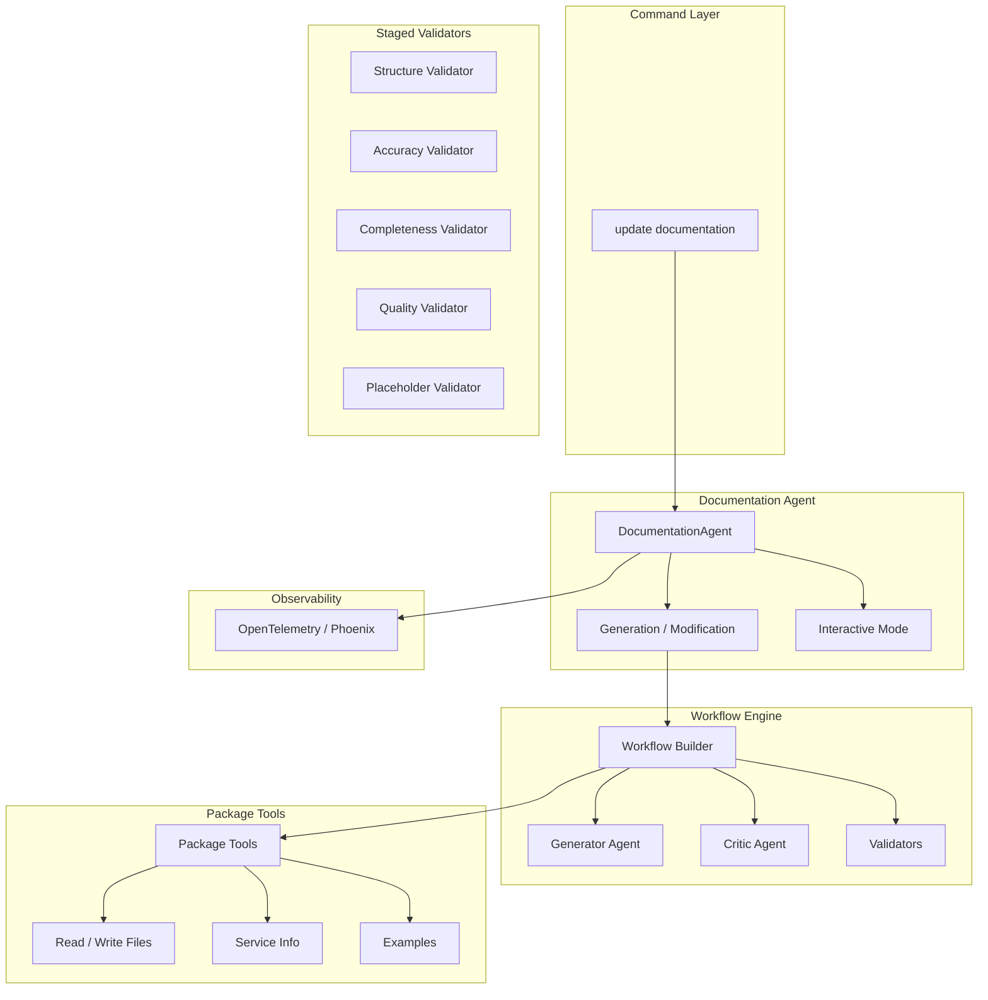

# LLM Agent Module

The `llmagent` module provides AI-powered documentation generation for Elastic integration packages. It uses a multi-agent architecture: a **DocumentationAgent** orchestrates generation and modification, while **workflow** runs a pipeline of **agents** (generator, critic, validators) with access to **tools** and optional **tracing**.

## Overview

The module:

- **Generates README documentation** from Elastic templates and style guidelines (section-based, with optional per-section validation loops).
- **Modifies existing docs** via scope analysis (global vs specific sections) and targeted section rewrites.
- **Validates content** with static validators (structure, completeness, accuracy, style, etc.) and optional LLM-based validators.
- **Uses a critic–generator loop** inside the workflow: critic approves or rejects; feedback is fed back to the generator.
- **Leverages `service_info.md`** as the primary source for vendor-specific content via the `get_service_info` tool.
- **Evaluates documentation quality** (single-package or batch) in the `doceval` package, with metrics and optional tracing.

## Architecture



## Module Structure

### `/docagent`

Orchestrates documentation generation and modification. Entry points are `UpdateDocumentation` (full generation) and `ModifyDocumentation` (targeted edits).

| File | Description |
|------|-------------|
| `docagent.go` | **DocumentationAgent**: section-based generation, modification, validation loops, doc path/backup/restore, prompt building wiring. |
| `prompts_builder.go` | Builds prompts from type (revision, section generation, modification analysis, modification) and **PromptContext**; loads templates via `prompts` package. |
| `modification_analyzer.go` | Analyzes modification requests to determine scope (global vs specific sections) and returns **ModificationScope**. |
| `interactive.go` | Interactive review UI: display readme, user actions (approve/edit/cancel), revision prompts. |
| `service_info_parser.go` | **ServiceInfoManager**: resolves path to `service_info.md`, loads and parses it into sections, exposes **GetSections** / **GetAllSections** for the `get_service_info` tool. |
| `file_ops.go` | Read/write current readme, backup/restore original, display in browser. |
| `postprocessor.go` | **EnsureDataStreamTemplates**: adds/removes `{{event "name"}}` and `{{fields "name"}}` in the Reference section based on package data streams; used after assembly. |

**Key functions in `docagent.go`:**

| Function | Description |
|----------|-------------|
| `UpdateDocumentation(ctx, nonInteractive)` | Entry point for full doc generation (uses default **GenerationConfig**). |
| `ModifyDocumentation()` | Targeted modification: scope analysis → apply changes to affected sections → write. |
| `GenerateAllSectionsWithValidation()` | Per-section generate–validate loop; tracks best iteration by length/structure; combines sections and runs **FixDocumentStructure** + **EnsureDataStreamTemplates**. |
| `GenerateSectionWithValidationLoop()` | Single-section loop: workflow run → heuristic “best” selection → static validation; returns **SectionGenerationResult**. |
| `GenerateAllSectionsWithWorkflow()` | Alternative: generates all sections via workflow only (no per-section validation loop). |
| `FixDocumentStructure()` | Ensures document title matches package (via **parsing.EnsureDocumentTitle**). |
| `EnsureDataStreamTemplates()` | Postprocessor: ensures/removes `{{event}}` and `{{fields}}` in Reference (see **postprocessor.go**). |

### `/docagent/parsing`

Pure markdown/section utilities. No I/O or package layout; input is content strings.

| File | Description |
|------|-------------|
| `section.go` | **Section** struct, **ParseSections** (hierarchical), **BuildFullContent**, **FlattenSections**, **FindSectionByTitle** / **FindSectionByTitleHierarchical**, **GetParentSection**, **CombineSections** / **CombineSectionsWithTitle**, **EnsureDocumentTitle**. |
| `combiner.go` | Section combining and title helpers. |
| `extraction.go` | **ExtractSectionFromLLMResponse**: extracts section content from LLM output; used when mapping raw model output to a section. |

### `/docagent/executor`

LLM execution via Google ADK.

| File | Description |
|------|-------------|
| `executor.go` | **Executor**: ADK-based LLM executor; **ExecuteTask** runs a single task with tools/toolsets; supports tracing. |

### `/docagent/prompts`

Prompt templates and loading. Templates use `%s`/`%d` placeholders; **prompts_builder** in docagent fills them.

| File | Description |
|------|-------------|
| `resources.go` | Embedded prompt files. |
| `loader.go` | **Load** by type and profile; external file override when configured. **Type**: Revision, SectionGeneration, ModificationAnalysis, Modification. |
| `section_instructions.go` | **GetSectionInstructions**: section-specific instructions for the generator (e.g. Reference, Troubleshooting). Uses **validators.PackageContext**. |
| `_static/agent_instructions.md` | Main agent system prompt (style, voice, templates). |
| `_static/section_generation_prompt.txt` | Section generation prompt template. |
| `_static/revision_prompt.txt` | Revision prompt template. |
| `_static/modification_prompt.txt` | Modification prompt template. |
| `_static/modification_analysis_prompt.txt` | Modification scope analysis prompt template. |

### `/docagent/stylerules`

Shared formatting rule constants (no dependencies on other docagent packages to avoid cycles). Used by workflow, generator, critic, and style validator.

| File | Description |
|------|-------------|
| `style_rules.go` | **CriticalFormattingRules**, **FullFormattingRules**, **CriticRejectionCriteria** (lists, headings, links, code blocks, voice). |

### `/docagent/agents`

Workflow agents: generator, critic, and shared state/registry.

| File | Description |
|------|-------------|
| `generator.go` | Generator agent: builds instruction from **SectionContext** + **FullFormattingRules**; returns generated markdown. |
| `critic.go` | Critic agent: reviews content against **FullFormattingRules** and **CriticRejectionCriteria**; returns **CriticResult** (approved + feedback). |
| `registry.go` | **Registry**: registers and orders **SectionAgent**s; **DefaultRegistry** returns the default agent set. |
| `statetools.go` | **StateStore**, **SetActiveStateStore** / **ClearActiveStateStore**: shared state for tools (e.g. feedback between critic and generator). |

### `/docagent/agents/validators`

Staged validators and shared types. Used by workflow (static/LLM validation) and by docagent’s per-section validation.

| File | Description |
|------|-------------|
| `interface.go` | **SectionAgent**, **StagedValidator** interfaces; **Scope** (section vs full document). |
| `validator.go` | Core validator types. |
| `staged_validator.go` | Base staged validator behavior. |
| `package_context.go` | **PackageContext**: manifest, data streams, service info, vendor setup; **LoadPackageContextForDoc**; used by validators and prompts. |
| `structure_validator.go` | Structure (full-document): required sections, order. |
| `completeness_validator.go` | Completeness (full-document): required content present. |
| `accuracy_validator.go` | Accuracy (section or both): content matches package. |
| `quality_validator.go` | Quality (section or both): clarity, completeness of section. |
| `style_validator.go` | Style (section or both): Elastic style; uses **stylerules.FullFormattingRules**. |
| `placeholder_validator.go` | Placeholders (section or both): correct placeholder usage. |
| `accessibility_validator.go` | Accessibility (section or both). |
| `urlvalidator.go` | URL validation utilities. |

### `/docagent/workflow`

Runs the multi-agent pipeline for one section: generator → critic (optional) → static validators → optional LLM validators; repeats until approved or max iterations.

| File | Description |
|------|-------------|
| `workflow.go` | **Builder**, **ExecuteWorkflow**: loop over generator, critic, URL validator, static validators, LLM validators; state store for feedback; returns **Result** (Content, Approved, Feedback). |
| `config.go` | **Config**: registry, model, tools, toolsets, max iterations, critic/URL/static/LLM validation flags, **PackageContext**. Fluent API: **WithModel**, **WithTools**, **WithStaticValidation**, **WithFullValidation**, etc. |

### `/doceval`

Documentation quality evaluation: single-package or batch, with metrics and optional tracing.

| File | Description |
|------|-------------|
| `evaluation.go` | **Evaluate**: creates a **DocumentationAgent**, runs **GenerateAllSectionsWithValidation**, runs validators and computes **QualityMetrics** / **ValidationSummary**; returns **EvaluationResult** (content, approved, metrics, validation summary, trace session ID). **EvaluationConfig**: output dir, max iterations, tracing, model ID. |
| `batch.go` | **BatchEvaluate**: evaluates multiple packages (from an integrations path and name list) with configurable parallelism. **BatchEvaluationConfig**: integrations path, output dir, package names, parallelism, API key, model, max iterations, tracing, profile. |
| `metrics.go` | **QualityMetrics** computation and **ValidationSummary** aggregation from validator results. |

### `/tools`

Tools exposed to the executor for package inspection. Used by docagent when building the executor.

| File | Description |
|------|-------------|
| `package_tools.go` | **PackageTools**: returns ADK tools for **list_directory**, **read_file**, **write_file**, **get_example** (section by title), **get_service_info** (section titles; uses **ServiceInfoProvider** so docagent can inject **ServiceInfoManager**). |
| `examples.go` | **GetDefaultExampleContent**: loads example README content (e.g. from **archetype** or `_static/examples/`). |
| `_static/examples/` | Example README files for style reference. |

### `/mcptools`

Model Context Protocol (MCP) integration for ADK: load MCP config and attach toolsets to the executor.

| File | Description |
|------|-------------|
| `mcp.go` | **MCPJson**, **MCPServer**; **Connect** to MCP server; **LoadToolsets** for use with executor. |

### `/tracing`

OpenTelemetry tracing for sessions, workflows, and spans; OTLP export (e.g. to Phoenix/Arize). OpenInference-style attributes.

| File | Description |
|------|-------------|
| `tracing.go` | **Config**, **InitWithConfig**, **Shutdown**, **ForceFlush**; **StartSessionSpan**, **StartChainSpan**, **EndChainSpan**, **StartWorkflowSpanWithConfig**; **SessionIDFromContext**; **RecordSessionInput**, **RecordWorkflowResult**. |
| `phoenix.go` | Phoenix (Arize) integration helpers. |

### `/ui`

User-facing helpers for documentation preview.

| File | Description |
|------|-------------|
| `browser_preview.go` | Browser-based documentation preview. |
| `_static/preview_template.html` | HTML template for preview. |

## Service Info Knowledge Base

The generator uses `service_info.md` as the primary source for vendor-specific documentation.

- **Location**: `docs/knowledge_base/service_info.md` (or under `docs/knowledge_base/<docbase>/` for non-README docs).
- **ServiceInfoManager** (in **service_info_parser.go**): loads and parses the file into sections; **GetSections(sectionTitles)** returns content for requested README sections.
- The **get_service_info** tool (in **tools**) calls into this; the generator is instructed to call it before writing each section.
- If the file is missing, the tool returns empty and the generator continues with other sources.

## Section-Based Generation

1. **Template + existing content**: **loadTemplateExampleExistingSections** (or equivalent) loads the package README template and example content, parses sections, and optionally loads existing readme sections.
2. **Per-section generation**: Each top-level section is generated in parallel (or with a per-section validation loop). For each section, **buildSectionContext** builds **validators.SectionContext** (template, example, existing); either **GenerateSectionWithValidationLoop** (with best-iteration tracking and static validation) or the **workflow** alone is used.
3. **Best-iteration selection**: In the validation loop, “best” is heuristic: longer content (e.g. 20%+) or similar length with more structural elements; validation feedback drives retries but the best content so far is kept.
4. **Assembly**: Sections are combined with **parsing.CombineSectionsWithTitle**; then **FixDocumentStructure** and **EnsureDataStreamTemplates** run (in docagent).
5. **Output**: Result is written to `_dev/build/docs/<targetDocFile>`.

## Workflow (Single Section)

For one section the workflow:

1. Runs the **generator** with section context and state store (feedback from previous iteration).
2. Optionally runs the **critic**; if it rejects, feedback is stored and the loop continues.
3. Optionally runs **URL validator**.
4. Runs **static validators** (if **PackageContext** is set); on issues, feedback is built and loop continues.
5. Optionally runs **LLM validators**; same feedback/continue behavior.
6. If all pass, returns approved content; otherwise continues up to **MaxIterations**.

**State store**: The workflow sets **ActiveStateStore** so tools and the next generator run can read/write feedback.

## Validation Pipeline

- **Section-level / both**: Accuracy, quality, style, placeholder, accessibility (and URL checks where used).
- **Full-document**: Structure, completeness. Run after sections are combined (e.g. in docagent after assembly or in doceval).

Validators implement **StagedValidator** and report **Scope** (section vs full document). **AllStagedValidators()** (in **agents**) returns the default set used by the workflow and by docagent’s **validateSectionContent**.

## Configuration

### GenerationConfig (docagent)

```go
type GenerationConfig struct {
    MaxIterations          uint  // Max iterations per section (default: 3)
    EnableStagedValidation bool  // Run static validation after each generation
    EnableLLMValidation    bool  // Run LLM-based validators
}
```

### Workflow Config

```go
type Config struct {
    Registry               *agents.Registry   // Agents to use in the workflow (defaults to DefaultRegistry)
    MaxIterations          uint               // Max refinement cycles per section (default 3)
    Model                  model.LLM          // LLM used for agents
    ModelID                string             // Model identifier for tracing
    Tools                  []tool.Tool        // Tools available to agents
    Toolsets               []tool.Toolset     // Toolsets available to agents
    EnableCritic           bool               // Run critic agent for feedback
    EnableURLValidator     bool               // Run URL validator agent
    EnableStaticValidation bool               // Run validators that check against package files
    EnableLLMValidation    bool               // Run LLM-based semantic validation
    PackageContext         *validators.PackageContext // Package metadata for validation
}
```

Example: `workflow.DefaultConfig().WithModel(m).WithModelID("...").WithTools(tools).WithStaticValidation(pkgCtx)` or **WithFullValidation(pkgCtx)** for both static and LLM validation.

## Usage

### Programmatic

```go
agent, err := docagent.NewDocumentationAgent(ctx, docagent.AgentConfig{
    APIKey:      apiKey,
    ModelID:     "gemini-3-flash-preview",
    PackageRoot: "/path/to/package",
    DocFile:     "README.md",
})
// Full generation
err = agent.UpdateDocumentation(ctx, nonInteractive)
// Targeted modification
err = agent.ModifyDocumentation(ctx, nonInteractive, "Add troubleshooting section")
```

### CLI

```bash
# Interactive generation
elastic-package update documentation

# Non-interactive
elastic-package update documentation --non-interactive

# Modification
elastic-package update documentation --modify-prompt "Add troubleshooting section"

# Single-package evaluation
elastic-package update documentation --evaluate --evaluate-output-dir ./results

# Batch evaluation
elastic-package update documentation --evaluate \
  --evaluate-batch citrix_adc,nginx,apache \
  --evaluate-integrations-path ~/git/integrations \
  --evaluate-output-dir ./batch_results \
  --evaluate-parallel 4
```

## Tracing

Tracing is optional and controlled by profile config (**llm.tracing.enabled**, **llm.tracing.endpoint**, etc.). Spans follow session → chain → workflow/section. Use **SessionIDFromContext** and Phoenix to inspect runs.

## Design Decisions

1. **Section-based generation**: Each section is generated (and optionally validated) separately; best iteration is tracked to avoid regression.
2. **Critic–generator loop**: Critic feedback is stored in state and passed into the next generator call.
3. **Validation scope**: Full-document validators run after assembly; section-level (or “both”) validators run during section generation or in the workflow.
4. **Service info as primary source**: **get_service_info** is the preferred source for vendor content; **ServiceInfoManager** and package layout are in docagent/tools, not in parsing.
5. **stylerules package**: Formatting rules live in a small dependency-free package to avoid import cycles between docagent, workflow, and agents.
6. **Postprocessor**: **EnsureDataStreamTemplates** runs after assembly so `{{event}}` / `{{fields}}` are correct regardless of generator output.
