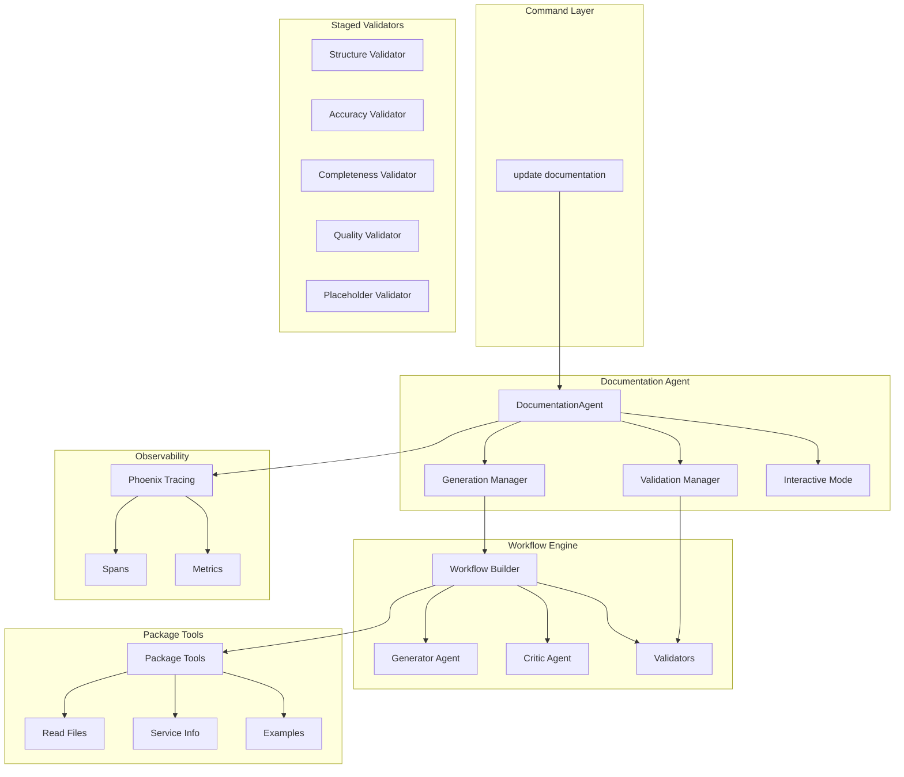
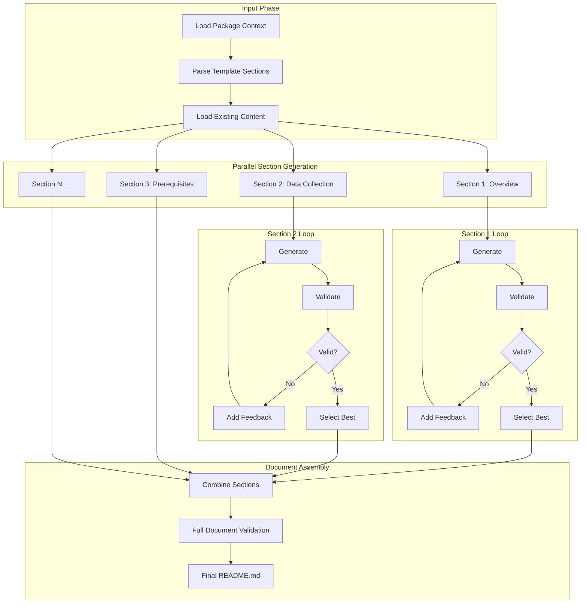
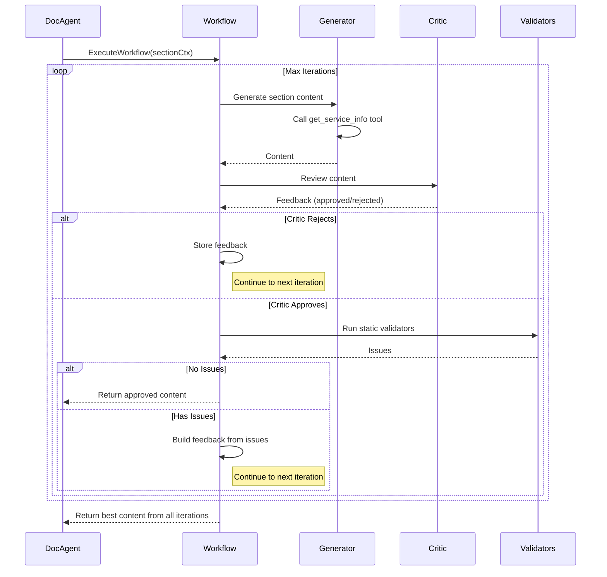
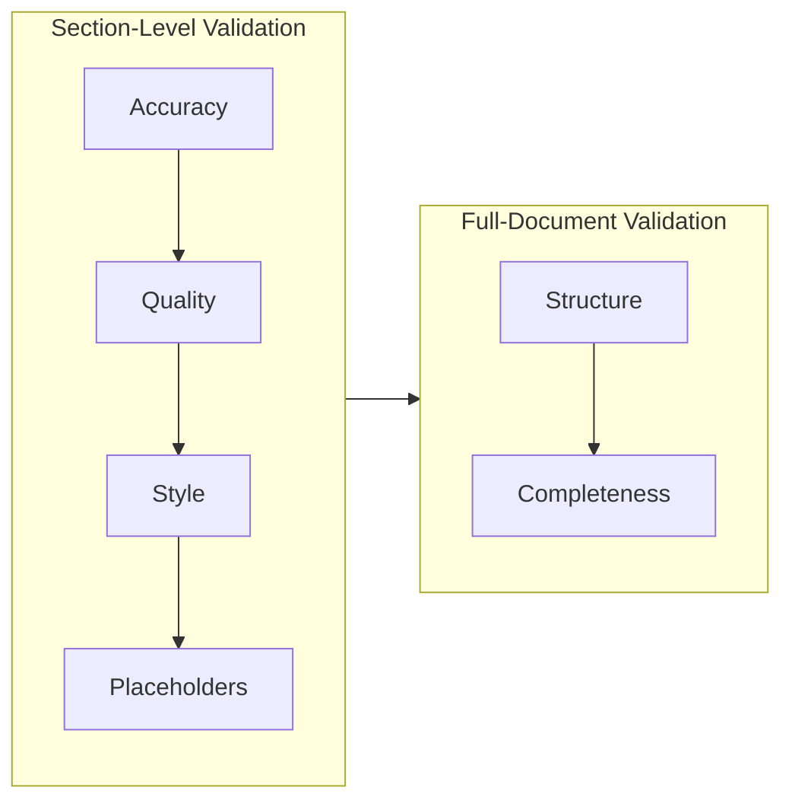
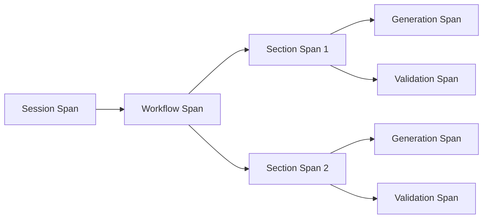

# LLM Agent Module

The `llmagent` module provides AI-powered documentation generation for Elastic integration packages. It uses a multi-agent architecture with specialized agents for generation, validation, and quality assurance.

## Overview

This module implements an LLM-based documentation generation system that:

- **Generates comprehensive README documentation** following Elastic's templates and style guidelines
- **Uses section-based generation** for higher quality output
- **Validates content** using both static and LLM-based validators
- **Supports iterative refinement** with critic feedback loops
- **Leverages authoritative knowledge bases** via `service_info.md` files
- **Provides tracing and metrics** for debugging and evaluation

## Architecture



## Module Structure

### `/docagent`
The main documentation agent that orchestrates the generation process.

| File | Description |
|------|-------------|
| `docagent.go` | Main DocumentationAgent with section-based generation |
| `prompts.go` | Prompt building and context management |
| `evaluation.go` | Documentation quality evaluation |
| `batch.go` | Batch processing for multiple packages |
| `interactive.go` | Interactive review and modification UI |
| `section_generator.go` | Section content extraction |
| `service_info_parser.go` | Service knowledge base parsing |
| `metrics.go` | Quality metrics calculation |
| `file_ops.go` | File read/write operations |
| `modification_analyzer.go` | Modification request analysis |

### `/docagent/parsing`
Markdown parsing utilities for documentation processing.

| File | Description |
|------|-------------|
| `section.go` | Section struct, ParseSections, and related utilities |
| `combiner.go` | CombineSections, EnsureDocumentTitle |
| `extraction.go` | Extract markdown content from LLM responses |

### `/docagent/executor`
LLM execution capabilities.

| File | Description |
|------|-------------|
| `executor.go` | ADK-based LLM executor with tracing |

### `/docagent/prompts`
Prompt management and templates.

| File | Description |
|------|-------------|
| `resources.go` | Embedded prompt templates |
| `loader.go` | External prompt file loading |
| `section_instructions.go` | Section-specific generation instructions |
| `_static/agent_instructions.md` | Main agent style guide and instructions |
| `_static/modification_analysis_prompt.txt` | Modification request analysis prompt |
| `_static/modification_prompt.txt` | Content modification prompt |
| `_static/revision_prompt.txt` | Content revision prompt |
| `_static/section_generation_prompt.txt` | Section generation prompt |

### `/docagent/stylerules`
Shared formatting rules to avoid import cycles.

| File | Description |
|------|-------------|
| `style_rules.go` | Formatting rules constants (CriticalFormattingRules, FullFormattingRules, CriticRejectionCriteria) |

**Key functions in `docagent.go`:**

| Function | Description |
|----------|-------------|
| `UpdateDocumentation()` | Main entry point for documentation generation |
| `UpdateDocumentationWithConfig()` | Generation with custom configuration |
| `ModifyDocumentation()` | Targeted modification of existing documentation |
| `GenerateAllSectionsWithValidation()` | Per-section generation with validation loops |
| `GenerateSectionWithValidationLoop()` | Single section generation with iteration tracking |
| `GenerateAllSectionsWithWorkflow()` | Section generation using workflow builder |
| `DebugRunCriticOnly()` | Run critic agent in isolation for debugging |
| `DebugRunValidatorOnly()` | Run validator agent in isolation for debugging |
| `UpdateDocumentationGeneratorOnly()` | Run generator without critic/validator |
| `ValidateAndFixDocumentStructure()` | Validate and auto-fix document structure issues |

### `/docagent/specialists`
Specialized agents for different tasks in the workflow.

| File | Description |
|------|-------------|
| `generator.go` | Content generation agent |
| `critic.go` | Content review agent |
| `registry.go` | Agent registry |
| `statetools.go` | State management tools |

### `/docagent/specialists/validators`
Staged validators for content validation.

| Validator | Stage | Scope | Description |
|-----------|-------|-------|-------------|
| `structure_validator.go` | Structure | Full Document | Validates README structure and format |
| `accuracy_validator.go` | Accuracy | Both | Validates content accuracy against package |
| `completeness_validator.go` | Completeness | Full Document | Validates all required content is present |
| `quality_validator.go` | Quality | Both | Validates writing quality |
| `placeholder_validator.go` | Placeholders | Both | Validates placeholder usage |
| `style_validator.go` | Quality | Both | Validates Elastic style compliance |
| `accessibility_validator.go` | Quality | Both | Validates accessibility requirements |
| `vendor_setup_validator.go` | Accuracy | Both | Validates vendor setup documentation |
| `scaling_validator.go` | Completeness | Both | Validates scaling documentation |
| `service_info_link_validator.go` | Accuracy | Both | Validates vendor links from service_info.md |
| `advanced_settings_validator.go` | Completeness | Both | Validates advanced settings documentation |
| `interface.go` | - | - | Validator interface definitions |
| `package_context.go` | - | - | Package context for validators |
| `staged_validator.go` | - | - | Base staged validator types |
| `urlvalidator.go` | - | - | URL validation utilities |
| `validator.go` | - | - | Core validator types |

### `/docagent/workflow`
Workflow orchestration for multi-agent pipelines.

| File | Description |
|------|-------------|
| `workflow.go` | Main workflow builder and executor |
| `config.go` | Workflow configuration with fluent API |
| `snapshots.go` | Iteration snapshot management |

### `/validation`
Simplified entry point for validation (re-exports from validators).

| File | Description |
|------|-------------|
| `validation.go` | Re-exports core types from validators package |

### `/tools`
Package inspection and utility tools available to agents.

| File | Description |
|------|-------------|
| `package_tools.go` | Tools for reading package content |
| `examples.go` | Example documentation loader |
| `_static/examples/` | Example README files for style reference |

### `/mcptools`
Model Context Protocol (MCP) toolset integration.

### `/tracing`
OpenTelemetry tracing for debugging and evaluation.

| File | Description |
|------|-------------|
| `tracing.go` | Tracing initialization and spans |
| `phoenix.go` | Phoenix (Arize) integration |
| `validation.go` | Validation span helpers |

### `/ui`
User interface components.

| File | Description |
|------|-------------|
| `browser_preview.go` | Browser-based documentation preview |

## Service Info Knowledge Base

The generator uses `service_info.md` as an authoritative knowledge base for vendor-specific documentation. This file should be located at `docs/knowledge_base/service_info.md` within the package.

### How It Works

1. **Mandatory Tool Call**: The generator MUST call `get_service_info(readme_section=<SectionTitle>)` before generating content
2. **Primary Source of Truth**: Content from `service_info.md` takes precedence over other sources
3. **Section Matching**: The tool returns relevant sections based on the requested README section
4. **Graceful Fallback**: If the file doesn't exist, the generator proceeds with other sources

### service_info.md Structure

```markdown
## Vendor set up steps
### For Syslog Collection (GUI Method):
1. Log in to the management interface...
2. Navigate to **Configuration > System > Auditing**...

### For Syslog Collection (CLI Method):
1. SSH to the management IP...

## Kibana set up steps
1. Navigate to **Management > Integrations**...

## Validation Steps
### 1. Trigger Data Flow:
- Generate authentication event: ...

### 2. Check Data in Kibana:
1. Navigate to **Analytics > Discover**...

## Troubleshooting
### Common Configuration Issues
- Policy Not Bound: ...

## Documentation sites
- [Vendor Documentation](https://...)
```

## Section-Based Generation

The module uses a section-based approach for documentation generation, where each section of the README is generated independently with its own validation loop.



### Per-Section Validation Loop

Each section runs through multiple iterations with validation feedback:



### Critic-Generator Feedback Loop

The workflow includes a critic agent that reviews generated content:

1. **Critic Reviews**: After generation, the critic evaluates content for style, voice, and quality
2. **Feedback Storage**: Rejections are stored in `StateKeyFeedback`
3. **Generator Receives Feedback**: Next iteration includes "## Feedback to Address" section
4. **Iterative Improvement**: Generator addresses issues in subsequent attempts

### Best Iteration Selection

The system tracks the best version of each section across iterations:

1. **Content Length**: Significantly longer content (20%+) is considered better
2. **Structural Elements**: More bullet points, tables, code blocks indicate quality
3. **Validation Score**: Lower issue count is preferred

This prevents regression where later iterations might produce worse output due to context window limitations or model fatigue.

## Validation Pipeline

Validators are organized into stages and scopes:



### Validation Scope

| Scope | When Applied | Validators |
|-------|--------------|------------|
| `ScopeSectionLevel` | During section generation | (none currently) |
| `ScopeFullDocument` | After combining sections | Structure, Completeness |
| `ScopeBoth` | Both phases | Accuracy, Quality, Style, Placeholder, etc. |

## Configuration

### GenerationConfig (in docagent package)

```go
type GenerationConfig struct {
    MaxIterations          uint                      // Max iterations per section (default: 3)
    EnableStagedValidation bool                      // Enable validation after generation
    EnableLLMValidation    bool                      // Enable LLM-based semantic validation
    SnapshotManager        *workflow.SnapshotManager // For saving iteration snapshots
}
```

### Workflow Config

```go
type Config struct {
    Registry               *specialists.Registry
    MaxIterations          uint                      // Default: 3
    Model                  model.LLM
    ModelID                string
    Tools                  []tool.Tool
    Toolsets               []tool.Toolset
    EnableCritic           bool                      // Enable critic agent
    EnableURLValidator     bool                      // Enable URL validation
    EnableStaticValidation bool                      // Enable static validators
    EnableLLMValidation    bool                      // Enable LLM-based validation
    PackageContext         *validators.PackageContext
}
```

### Fluent Configuration API

```go
cfg := workflow.DefaultConfig().
    WithModel(model).
    WithModelID("gemini-3-flash-preview").
    WithTools(tools).
    WithMaxIterations(3).
    WithFullValidation(pkgCtx)  // Enables both static and LLM validation
```

## Usage

### Programmatic Usage

```go
// Create documentation agent
agent, err := docagent.NewDocumentationAgent(ctx, docagent.AgentConfig{
    APIKey:      apiKey,
    ModelID:     "gemini-3-flash-preview",
    PackageRoot: "/path/to/package",
    DocFile:     "README.md",
})

// Generate documentation (section-based)
err = agent.UpdateDocumentation(ctx, nonInteractive)

// Or with custom config
cfg := docagent.GenerationConfig{
    MaxIterations:          3,
    EnableStagedValidation: true,
    EnableLLMValidation:    true,
}
result, err := agent.GenerateAllSectionsWithValidation(ctx, pkgCtx, cfg)
```

### CLI Usage

```bash
# Interactive mode
elastic-package update documentation

# Non-interactive mode
elastic-package update documentation --non-interactive

# Modify existing documentation
elastic-package update documentation --modify-prompt "Add troubleshooting section"

# Evaluate documentation quality (single package)
elastic-package update documentation --evaluate --output-dir ./results

# Batch evaluation of multiple packages
elastic-package update documentation --evaluate \
  --batch citrix_adc,nginx,apache \
  --integrations-path ~/git/integrations \
  --output-dir ./batch_results \
  --parallel 4

# Debug modes - run individual agents in isolation
elastic-package update documentation --debug-critic-only      # Run only critic
elastic-package update documentation --debug-validator-only   # Run only validator
elastic-package update documentation --debug-generator-only   # Run only generator
```

### Debug Modes

The command supports three debug flags for running individual agents in isolation:

| Flag | Description |
|------|-------------|
| `--debug-critic-only` | Run only the critic agent on existing documentation to see quality feedback |
| `--debug-validator-only` | Run only the validator agent to check for issues without regenerating |
| `--debug-generator-only` | Run only the generator agent without critic/validator feedback loops |

These flags are mutually exclusive and useful for understanding how each agent evaluates documentation.

## Tracing

The module supports OpenTelemetry tracing with Phoenix (Arize) for debugging and evaluation:



Enable tracing:

```bash
export LLM_TRACING_ENABLED=true
export LLM_TRACING_ENDPOINT=http://localhost:6006/v1/traces
elastic-package update documentation
```

Traces are also saved to `traces.json` in the working directory for offline analysis.

## Testing

```bash
# Run all tests
go test ./internal/llmagent/...

# Run specific package tests
go test ./internal/llmagent/docagent/...

# Run with verbose output
go test -v ./internal/llmagent/docagent/...
```

## Key Design Decisions

1. **Section-based generation**: Generates each section independently to improve quality and enable parallel processing.

2. **Per-section best-iteration tracking**: Keeps the best version of each section across iterations to prevent regression.

3. **Critic-generator feedback loop**: Critic agent reviews content and provides feedback that's passed to subsequent generator iterations.

4. **Validation scope separation**: Full-document validators (structure, completeness) run only on the combined document, while section-level validators run during generation.

5. **Parallel generation**: Sections are generated in parallel goroutines for faster results.

6. **Service info as primary source**: The `get_service_info` tool provides authoritative vendor documentation that takes precedence over other sources.

7. **Static + LLM validation**: Combines fast static checks with semantic LLM-based validation for comprehensive quality assurance.

8. **Style rules isolation**: The `stylerules` package provides shared formatting rules without import cycles.

9. **Debug mode isolation**: Individual agents (generator, critic, validator) can be run in isolation for troubleshooting and development.

10. **Fluent configuration API**: Workflow configuration uses a fluent API for clean, readable setup.
