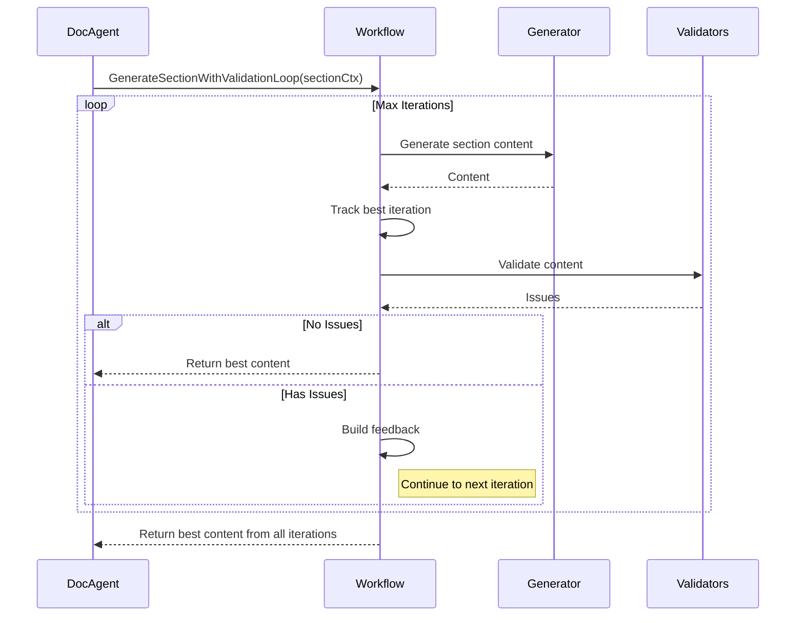

# LLM Agent Module

The `llmagent` module provides AI-powered documentation generation for Elastic integration packages. It uses a multi-agent architecture with specialized agents for generation, validation, and quality assurance.

## Overview

This module implements an LLM-based documentation generation system that:

- **Generates comprehensive README documentation** following Elastic's templates and style guidelines
- **Uses section-based generation** for higher quality output
- **Validates content** using both static and LLM-based validators
- **Supports iterative refinement** with feedback loops
- **Provides tracing and metrics** for debugging and evaluation

## Architecture


## Module Structure

### `/docagent`
The main documentation agent that orchestrates the generation process.

| File | Description |
|------|-------------|
| `docagent.go` | Main DocumentationAgent with section-based generation |
| `executor.go` | LLM executor for running agent tasks |
| `evaluation.go` | Documentation quality evaluation |
| `batch.go` | Batch processing for multiple packages |
| `interactive.go` | Interactive review and modification UI |
| `section_parser.go` | Markdown section parsing utilities |
| `section_combiner.go` | Combines sections into final document |
| `section_generator.go` | Section content extraction |
| `prompts.go` | Prompt templates and builders |
| `metrics.go` | Quality metrics calculation |

**Key functions in `docagent.go`:**

| Function | Description |
|----------|-------------|
| `UpdateDocumentation()` | Main entry point for documentation generation |
| `ModifyDocumentation()` | Targeted modification of existing documentation |
| `GenerateAllSectionsWithValidation()` | Per-section generation with validation loops |
| `GenerateSectionWithValidationLoop()` | Single section generation with iteration tracking |
| `GenerateFullDocumentWithWorkflow()` | Full document generation in one pass |
| `GenerateWithValidationLoop()` | Full document validation loop with best-section tracking |
| `GenerateAllSectionsWithWorkflow()` | Section generation using workflow builder |
| `DebugRunCriticOnly()` | Run critic agent in isolation for debugging |
| `DebugRunValidatorOnly()` | Run validator agent in isolation for debugging |
| `UpdateDocumentationGeneratorOnly()` | Run generator without critic/validator |

### `/docagent/specialists`
Specialized agents for different tasks in the workflow.

| File | Description |
|------|-------------|
| `generator.go` | Content generation agent |
| `critic.go` | Content review agent |
| `registry.go` | Agent registry |
| `statetools.go` | State management tools |

### `/docagent/specialists/validators`
Staged validators for content validation.

| Validator | Stage | Scope | Description |
|-----------|-------|-------|-------------|
| `structure_validator.go` | Structure | Full Document | Validates README structure and format |
| `accuracy_validator.go` | Accuracy | Both | Validates content accuracy against package |
| `completeness_validator.go` | Completeness | Full Document | Validates all required content is present |
| `quality_validator.go` | Quality | Both | Validates writing quality |
| `placeholder_validator.go` | Placeholders | Both | Validates placeholder usage |
| `style_validator.go` | Quality | Both | Validates Elastic style compliance |
| `accessibility_validator.go` | Quality | Both | Validates accessibility requirements |
| `vendor_setup_validator.go` | Accuracy | Both | Validates vendor setup documentation |
| `scaling_validator.go` | Completeness | Both | Validates scaling documentation |

### `/docagent/workflow`
Workflow orchestration for multi-agent pipelines.

| File | Description |
|------|-------------|
| `workflow.go` | Main workflow builder and executor |
| `config.go` | Workflow configuration |
| `context_builder.go` | Builds context for generation |
| `staged_workflow.go` | Staged validation workflow |
| `snapshots.go` | Iteration snapshot management |

### `/tools`
Package inspection and utility tools available to agents.

| File | Description |
|------|-------------|
| `package_tools.go` | Tools for reading package content |
| `examples.go` | Example documentation loader |

### `/mcptools`
Model Context Protocol (MCP) toolset integration.

### `/tracing`
OpenTelemetry tracing for debugging and evaluation.

| File | Description |
|------|-------------|
| `tracing.go` | Tracing initialization and spans |
| `phoenix.go` | Phoenix (Arize) integration |
| `validation.go` | Validation span helpers |

### `/ui`
User interface components.

| File | Description |
|------|-------------|
| `browser_preview.go` | Browser-based documentation preview |

## Section-Based Generation

The module uses a section-based approach for documentation generation, where each section of the README is generated independently with its own validation loop.


### Per-Section Validation Loop

Each section runs through multiple iterations with validation feedback:



### Best Iteration Selection

The system tracks the best version of each section across iterations:

1. **Content Length**: Significantly longer content (20%+) is considered better
2. **Structural Elements**: More bullet points, tables, code blocks indicate quality
3. **Validation Score**: Lower issue count is preferred

This prevents regression where later iterations might produce worse output due to context window limitations or model fatigue.

### Convergence Detection

The validation loop includes convergence detection to optimize iteration count:

1. **Issue Tracking**: Each iteration records the number of validation issues found
2. **Convergence Check**: If issues are decreasing between iterations, the system is "converging"
3. **Bonus Iteration**: If max iterations is reached but issues are still decreasing (converging), one bonus iteration is granted
4. **Early Exit**: If all validations pass, the loop exits immediately

This ensures the system doesn't stop prematurely when making progress, while avoiding infinite loops.

## Validation Pipeline

Validators are organized into stages and scopes:


### Validation Scope

| Scope | When Applied | Validators |
|-------|--------------|------------|
| `ScopeSectionLevel` | During section generation | (none currently) |
| `ScopeFullDocument` | After combining sections | Structure, Completeness |
| `ScopeBoth` | Both phases | Accuracy, Quality, Style, Placeholder, etc. |

## Configuration

### GenerationConfig

```go
type GenerationConfig struct {
    MaxIterations          uint              // Max iterations per section (default: 3)
    EnableStagedValidation bool              // Enable validation after generation
    EnableLLMValidation    bool              // Enable LLM-based semantic validation
    SnapshotManager        *SnapshotManager  // For saving iteration snapshots
}
```

### GenerationResult

```go
type GenerationResult struct {
    Content            string                      // Final generated documentation
    Approved           bool                        // Whether all validation stages passed
    TotalIterations    int                         // Total iterations across all sections
    BestIteration      int                         // Iteration that produced best content
    SectionResults     []SectionGenerationResult   // Per-section results
    StageResults       map[string]*StageResult     // Per-stage validation results
    ValidationFeedback string                      // Last validation feedback
    IssueHistory       []int                       // Issue counts per iteration
    ConvergenceBonus   bool                        // Whether bonus iteration was granted
}
```

### SectionGenerationResult

```go
type SectionGenerationResult struct {
    SectionTitle    string  // Title of the section
    SectionLevel    int     // Heading level (2 = ##, 3 = ###, etc.)
    Content         string  // Best generated content
    Approved        bool    // Whether validation passed
    TotalIterations int     // Iterations performed
    BestIteration   int     // Iteration that produced best content
    IssueHistory    []int   // Issue counts per iteration
}
```

### Workflow Config

```go
type Config struct {
    Model               model.LLM
    ModelID             string
    MaxIterations       uint
    EnableCritic        bool
    EnableValidator     bool
    EnableURLValidator  bool
    EnableStaticValidation bool
    EnableLLMValidation    bool
    PackageContext      *validators.PackageContext
}
```

## Usage

### Programmatic Usage

```go
// Create documentation agent
agent, err := docagent.NewDocumentationAgent(ctx, docagent.AgentConfig{
    APIKey:      apiKey,
    ModelID:     "gemini-3-flash-preview",
    PackageRoot: "/path/to/package",
    DocFile:     "README.md",
})

// Generate documentation (section-based)
err = agent.UpdateDocumentation(ctx, nonInteractive)

// Or with custom config
cfg := docagent.GenerationConfig{
    MaxIterations:          3,
    EnableStagedValidation: true,
    EnableLLMValidation:    true,
}
result, err := agent.GenerateAllSectionsWithValidation(ctx, pkgCtx, cfg)
```

### CLI Usage

```bash
# Interactive mode
elastic-package update documentation

# Non-interactive mode
elastic-package update documentation --non-interactive

# Modify existing documentation
elastic-package update documentation --modify-prompt "Add troubleshooting section"

# Evaluate documentation quality (single package)
elastic-package update documentation --evaluate --output-dir ./results

# Batch evaluation of multiple packages
elastic-package update documentation --evaluate \
  --batch citrix_adc,nginx,apache \
  --integrations-path ~/git/integrations \
  --output-dir ./batch_results \
  --parallel 4

# Debug modes - run individual agents in isolation
elastic-package update documentation --debug-critic-only      # Run only critic
elastic-package update documentation --debug-validator-only   # Run only validator
elastic-package update documentation --debug-generator-only   # Run only generator
```

### Debug Modes

The command supports three debug flags for running individual agents in isolation:

| Flag | Description |
|------|-------------|
| `--debug-critic-only` | Run only the critic agent on existing documentation to see quality feedback |
| `--debug-validator-only` | Run only the validator agent to check for issues without regenerating |
| `--debug-generator-only` | Run only the generator agent without critic/validator feedback loops |

These flags are mutually exclusive and useful for understanding how each agent evaluates documentation.

## Tracing

The module supports OpenTelemetry tracing with Phoenix (Arize) for debugging and evaluation:


Enable tracing:

```bash
export LLM_TRACING_ENABLED=true
export LLM_TRACING_ENDPOINT=http://localhost:6006/v1/traces
elastic-package update documentation
```

## Testing

```bash
# Run all tests
go test ./internal/llmagent/...

# Run specific package tests
go test ./internal/llmagent/docagent/...

# Run with verbose output
go test -v ./internal/llmagent/docagent/...
```

## Key Design Decisions

1. **Section-based generation**: Generates each section independently to improve quality and enable parallel processing.

2. **Per-section best-iteration tracking**: Keeps the best version of each section across iterations to prevent regression.

3. **Validation scope separation**: Full-document validators (structure, completeness) run only on the combined document, while section-level validators run during generation.

4. **Parallel generation**: Sections are generated in parallel goroutines for faster results.

5. **Rich context building**: Uses `BuildHeadStartContext()` to provide comprehensive package information to the generator.

6. **Static + LLM validation**: Combines fast static checks with semantic LLM-based validation for comprehensive quality assurance.

7. **Convergence-aware iteration**: Grants bonus iterations when issues are decreasing, preventing premature termination.

8. **Debug mode isolation**: Individual agents (generator, critic, validator) can be run in isolation for troubleshooting and development.

9. **SectionContext in validators package**: The `SectionContext` type lives in the `validators` package to provide proper encapsulation for validation logic.

10. **Helper function extraction**: Common section generation logic is extracted into `generateSingleSection()` for reuse between parallel and sequential modes.

